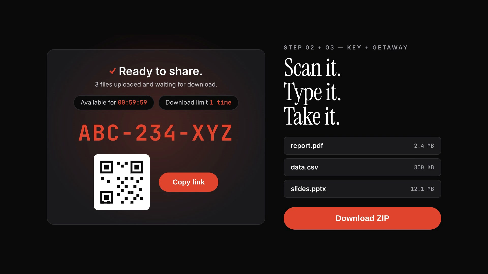

# LabStash

> Upload from the lab computer. Download it later. No account needed.

LabStash is a temporary file-sharing service designed for computer labs. Upload files before you leave, get a short code, and download them from any device later. Files auto-expire and have a configurable download limit — no Google login, no email attachment size limits, no forgotten sign-outs.

## Demo

https://github.com/user-attachments/assets/43630fd4-8e9f-4630-9ee7-81ae55105771



## How It Works

1. **Upload** — Drop your files into the uploader. Choose an expiry window (5 min to 1 hr) and a download limit (1–25).
2. **Get a key** — LabStash generates a short code like `ABC-234-XYZ` and a QR code.
3. **Download later** — Enter the code or scan the QR on any device to download everything as a ZIP.

## Tech Stack

| Layer | Technology |
|-------|-----------|
| Frontend | [Next.js 16.3](https://nextjs.org) (React 19), TypeScript, Tailwind CSS v4 |
| Backend | [FastAPI](https://fastapi.tiangolo.com) (Python 3.14) |
| Database | [Neon PostgreSQL](https://neon.tech) |
| File Storage | [Cloudflare R2](https://www.cloudflare.com/r2/) (S3-compatible) |
| Caching | [Upstash Redis](https://upstash.com) |
| Frontend Deploy | [Vercel](https://vercel.com) |
| Backend Deploy | [Render](https://render.com) |

## Project Structure

```
labstash/
├── backend/              # FastAPI API server
│   ├── routes/           # Upload, download, delete endpoints
│   ├── services/         # Cloudflare R2 client
│   ├── lib/              # Redis client
│   └── tests/            # Pytest test suite
├── frontend/             # Next.js App Router
│   ├── app/              # Pages (home, download, /d/:id)
│   ├── components/       # React components
│   ├── lib/api/          # API client functions
│   └── types/            # TypeScript interfaces
├── CONTRIBUTING.md       # Contribution guide
└── docker-compose.yaml   # Local Redis for dev
```

## Getting Started

See [CONTRIBUTING.md](CONTRIBUTING.md) for full setup instructions, or jump straight to:

- **[Backend README](backend/README.md)** — API endpoints, database schema, auto-deletion internals
- **[Frontend README](frontend/README.md)** — Frontend routes, component architecture, design system

## API

| Method | Endpoint | Description |
|--------|----------|-------------|
| `POST` | `/api/upload` | Upload files |
| `GET` | `/api/files/{id}` | List files (manifest) |
| `GET` | `/api/download/{id}` | Download all as ZIP |
| `DELETE` | `/api/delete/{id}` | Delete upload immediately |

## Contributing

Contributions are welcome! Read the [contribution guide](CONTRIBUTING.md) to get started with local development, branch naming, and code style.

## Made with ❤️ by [@StackFox](https://github.com/StackFox) · [rakshit.codes](https://rakshit.codes)
